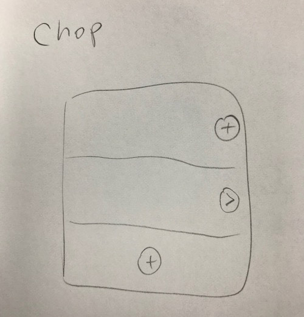

일단 목표는 간단한 할 일 앱(to do list)을 만드는 것이다. 할 일들(to-do)이 List형태로 주욱 보여지는 그것 말이다. 그런데 그것만으로는 너무 지나치게 간단할 뿐더러 차별성이 전혀 없으므로 핵심적인 차별점 하나를 부여하기로 했다. 

그것은 "일을 나눈다(혹은 쪼갠다)"는 개념이다. 마인드맵에서 약간 힌트를 얻은 개념인데, 어떤 특정한 업무나 작업을 일단 하려고 하면, 보다 세부적인 일들로 쪼개지는 경우가 다반사이다. 그럴 때 마치 마인드맵처럼 계속 쪼개가면서 세부적인 일을 처리해나가고, 그렇게 처리된 일들로 상위의 일들이 얼마나 완수되는지를 쉽게 추적할 수 있는 시스템이 있으면 좋겠다고 생각했다. 

이런 개념이 특히 빛을 발하는 것은 쪼갠 일을 다른 사람에게 delegation을 쉽게 해줄 수 있는 부분일 것이다. 쪼갠 일을 다른 사람에게 할당하면, 그 사람의 to-do list에 그 일이 뚜둔!하고 나타나는 것이다. 그럼 그 사람은 그 일을 검토하며 다시 쪼개나가다가 필요한 부분은 다시 다른 사람에게 주고.. 

실제 구현에서도 linked list의 구조로 작업들을 물리게 해놓고, 각 작업의 생성자와 소유주를 분리하여 할당할 수 있게 해놓으면, 구조면에서 어렵지 않으면서도 꽤나 유용한 애플리케이션이 될 것 같다. 

이러한 아이디어를 간단하게 그림으로 옮기면 다음과 같다. 

아주 심플하게 iOS식으로 표현하면 테이블로 작업 리스트를 나열하고, 각 작업별로 일을 쪼개거나 기존에 쪼개져있는 일을 확인하고 (기존에 쪼개져 있는 일을 확인할 때는 원래의 리스트가 왼쪽으로 슬라이드되고 우측에서 새로운 리스트가 나옴) 새로운 일을 추가할 때는 하단에 있는 + 표시를 누르는 식이다. 직관적이지 않은가!

일단은 이와 같은 구조로 개인 사용자 수준에서 동작하는 앱을 만드는 것이 목표이다. 다른 사용자를 추가하는 부분은 일단 배제하되, 서버와 데이터는 연동되게 만들 것이다. (연동규칙을 정하는 것도 골치아픈 문제일 것 같긴 하다)

앱의 이름은 Chop으로 정했다. 차후에 앱스토어나 플레이스토어에 올릴 때는 물론 Chop: easy but powerful to-do app 식으로 부제를 달 것인데 그 내용은 천천히 생각해보기로 하자. 